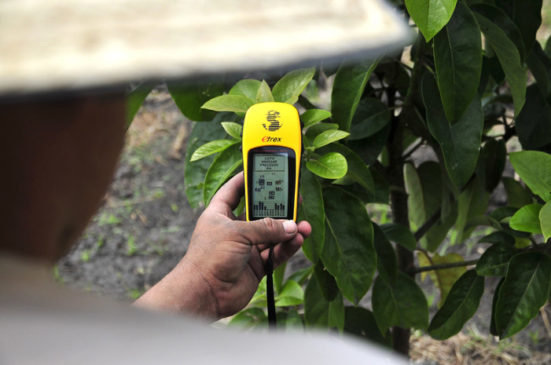
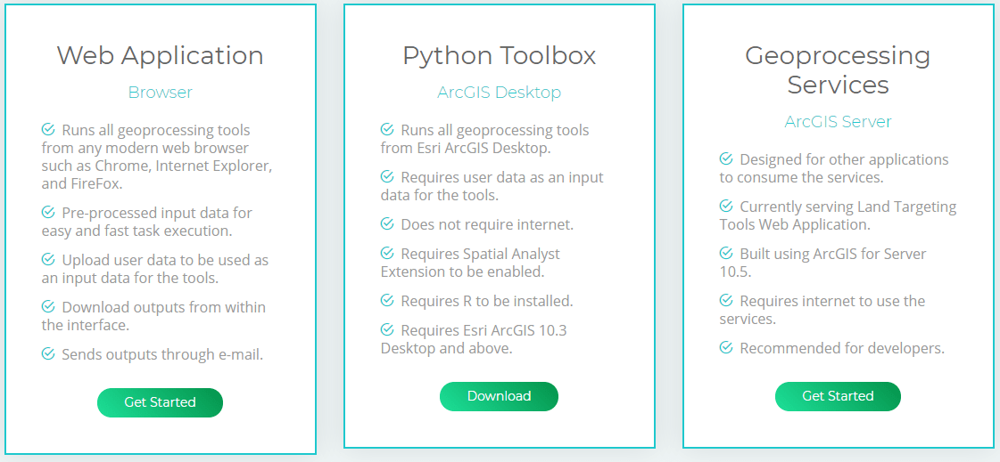
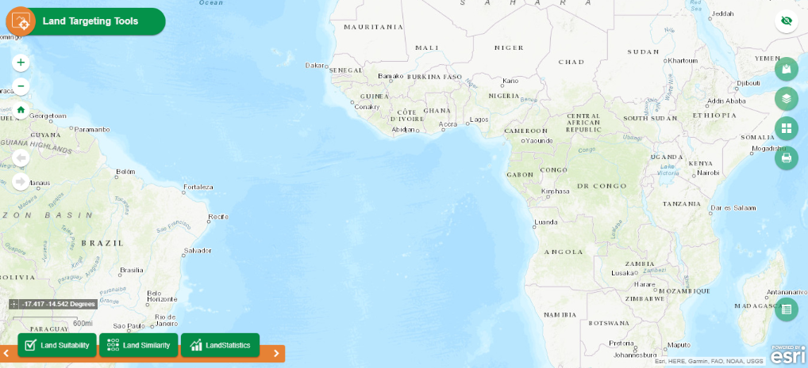
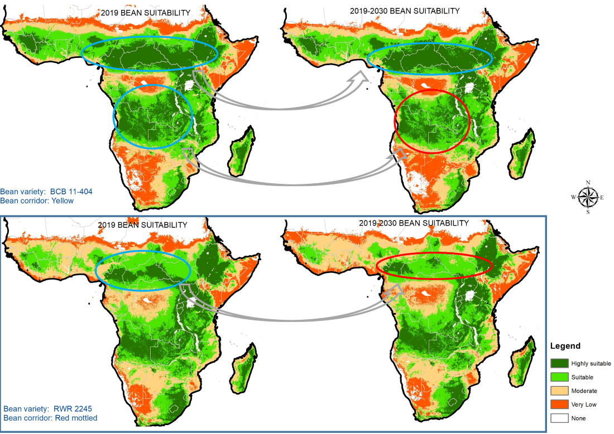

```{r setup, include=FALSE}
knitr::opts_chunk$set(warning = FALSE, 
                      message = FALSE, 
                      comment = NA, 
                      dpi = 300, 
                      echo = FALSE, 
                      cache = FALSE)
```

# Background

--

- Site-specific crop management is the fundamental basis for sustainable intensification of crop and livestock production.

.center[


Image credit: [Neil Palmer]

]


---

# Heterogeneity of agricultural systems

--

- Bio-physical

--

- Socio-economic

--

.center[


]

--

- Influences suitability and adoption of interventions

- Also influences impacts -when adopted and out-scaled

---

# What you need to know

.pull-left[

- Runs on Python

  - Targeting toolbox is an ArcGIS toolbox (.pyt) purely developed using Python programming language, ArcPy library.

- Toolbox tools

  - It is made of three tools; *Land Suitability*, *Land Similarity* and *Land Statistics* tool.

- Land Suitability Tool

  - Matches suitability criteria with a spatial database. *Suitability maps*: areas where a specific strategy is likely to have a positive impact.

]

.pull-right[

- Land Similarity Tool
  
  - Estimates the potential for out-scaling using socio-ecological characterization and similarity analysis. *Similarity maps*: indicating the wider applicability of the intervention.

- Land Statistics Tool

  - Calculates zonal statistics, e.g. total area/mean covered by human and/or livestock population....,*Output table*: Statistics per suitability/similarity class.
  
]

---

# Get Tools

- Depending on your needs and requirements you can use the tools in these platforms.

.center[



]

---

# Web interface <https://targetingtools.ciat.cgiar.org/>



---

# Land suitability

.pull-left[


]

.pull-right[

- Combining suitability maps

- For binary output:
    - min value = optimal from 
    - optimal to = max value
    
- For gradient:
    - min value < optimal from 
    - optimal to > max value

]

---

# Land similarity

.pull-left[


]

.pull-right[

Compares different geographical layers 

- Assesses to what  extent each pixel is similar to a reference point ~ distance. 

Two methods:

  - Mahalanobis similarity: assess the distance by measuring how many standard deviations away a given value is away from the reference point. 
  
  - Multivariate Environmental Similarity Surfaces (MESS): uses an index that compares the value of a point in space with the distribution of the reference points. 

]
---

# Land statistics

.pull-left[


]

.pull-right[

- How big is the suitable area?

- How many people live in it?

- What is the average cattle density?

]

---

# System availability

- Global;

- Countries.

---

# Use cases
- The tool is ideal for the use by:

  - Students;
  
  - Educators; 
  
  - Development practitioners.

---

# Pan-Africa Bean Research Alliance (PABRA)

.center[



]

---

# Suitability of Forages in Tanzania 

.center[


]

---

# How can you contribute

- Report use cases <https://targetingtools.ciat.cgiar.org/>

--

- File issues/ report a bug via [GitHub](https://github.com/CIAT/targeting_tools_10_3)

--

- Feature request

---

class: dv, center, middle

# Thank you!

---

background-image: url("ciat_end.png")
background-size: cover